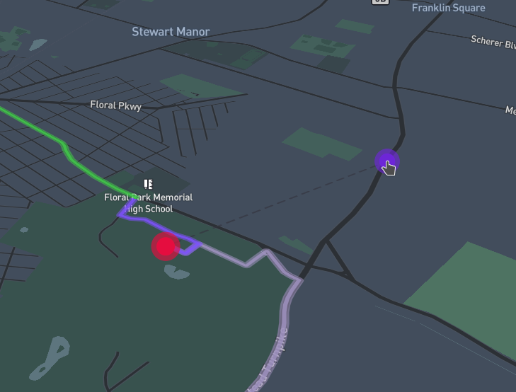

# Maplibre GL Directions

A plugin to show routing directions on a MapLibre GL JS map. Supports any [OSRM](http://project-osrm.org/) or [Mapbox Directions API](https://docs.mapbox.com/api/navigation/directions/) compatible Routing-provider.




[Live Demo](https://maplibre.github.io/maplibre-gl-directions/#/).

---

## Features

### Different Routing-providers

The plugin supports any OSRM- or Mapbox Directions API-compatible Routing-provider out of the box!

### Sane Defaults

Works without any configuration at all out of the box, though at the same time configurable enough to support most of the imaginable scenarios.

### User interaction

Add waypoints by clicking the map, click a waypoint to remove it, drag waypoints to move them, add waypoints in-between existing ones by dragging the selected route line, change the selected route by clicking an alternative route line or completely disable the user interaction with a single call. Everything is touch-friendly!

### Congestions

Supports the Mapbox Directions API congestions (both plain and numeric!)

### Customization

The powerful customization interface allows to customize everything starting from visual aspects all the way up to request logic.

### TypeScript support

The plugin is written 100% in TypeScript and therefore ships with built-in types.

## Installation

```shell
$ npm i @maplibre/maplibre-gl-directions
```

## Usage

```typescript
// Import the plugin
import MaplibreGlDirections from "@maplibre/maplibre-gl-directions";

// Create an instance of the default class
const directions = new MaplibreGlDirections(map);

// Enable interactivity (if needed)
directions.interactive = true;

// Set the waypoints programmatically
directions.setWaypoints([
  [-73.8271025, 40.8032906],
  [-73.8671258, 40.82234996],
]);

// Remove waypoints
directions.removeWaypoint(0);

// Add waypoints
directions.addWaypoint([-73.8671258, 40.82234996], 0);

// Remove everything plugin-related from the map
directions.clear();
```

Check out the [Demo](https://maplibre.org/maplibre-gl-directions/#/) or dive right into the [API Docs](https://maplibre.org/maplibre-gl-directions/api) for more!

## Future plans

- Emit events
- Implement default control
- Write tests
